# Capstone-project-Arvato

#  Identifying Customer Segments

## Ⅰ. How to find your customer?

   In the near future, data-driven social is comming. We can find a vast offering of reviews for all kinds of products.  
This information will help us to make better decision. Algorithms will help us quickly navigate to the right oppotunities  
as we come to better understand the value we sell and the value we need.  
 In this case, in order to improve the efficiency of marketing campaigns, a company might decide to find out what   
 segments of the population are more likely to consume its products, and target them with advertising.  

We will applying machine learning techniques to identify segments of the population that form the core customer base for   
 a mail-order sales company in Germany. These segments can then be used to direct marketing campaigns towards audiences  
 that will have the highest expected rate of returns. 
 
The data used was provided by Udacity partners at Bertelsmann Arvato Analytics. Datasets are only used for teaching  
activities.  
 
Now, we will analyze the data step by step to find our customers.  

## Ⅱ. Understand the data

There are some data files in this project:

* `Udacity_AZDIAS_052018.csv`: Demographics data for the general population of Germany; 891 211 persons (rows) x 366 features (columns).
* `Udacity_CUSTOMERS_052018.csv`: Demographics data for customers of a mail-order company; 191 652 persons (rows) x 369 features (columns).
* `Udacity_MAILOUT_052018_TRAIN.csv`: Demographics data for individuals who were targets of a marketing campaign; 42 982 persons (rows) x 367 (columns).
* `Udacity_MAILOUT_052018_TEST.csv`: Demographics data for individuals who were targets of a marketing campaign; 42 833 persons (rows) x 366 (columns).
* `DIAS Attributes - Values 2017.xlsx`: Brief introduction of the data features

Each row of the demographics files represents a single person, but also includes information outside of individuals,  
including information about their household, building, and neighborhood.
here is the sample preview of the data structure from "Udacity_AZDIAS_052018.csv"
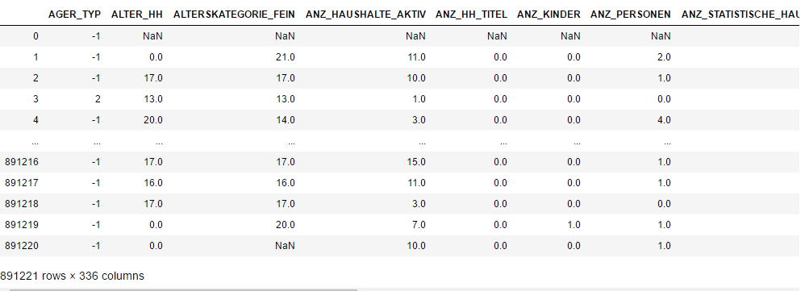
we can get features's introduction from "DIAS Attributes - Values 2017.xlsx"

## Ⅲ. process and clean data

#### step1. Drop some columns not described in "DIAS Attributes"
First, deal with unknown features, we drop the columns which not described in the aid file. 
#### step2. manualy creat a map file "DIAS_Feature_Summary.csv" 
This file will help us transfer the missing or unknown values to Nan.  
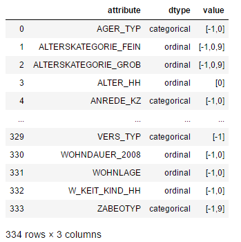
#### step3. Drop the data which have high proportion of missing values.  
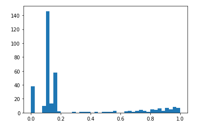  
here, we drop columns with count of null values bigger than 20%  
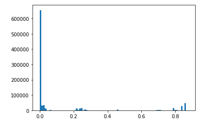  
also, we drop rows with count of null values bigger than 30%  
#### step4. Deal with Categorical values

>> - For binary (two-level) categoricals that take numeric values, you can keep them without needing to do anything.
>> - There is one binary variable that takes on non-numeric values. For this one, you need to re-encode the values as  
numbers or create a dummy variable.
>> - For multi-level categoricals (three or more values), you can choose to encode the values using multiple dummy  
>variables (e.g. via [OneHotEncoder](http://scikit-learn.org/stable/modules/generated/sklearn.preprocessing.OneHotEncoder.html)),  
>or (to keep things straightforward) just drop them from the analysis. As always, document your choices in the Discussion section.
>> - We drop some object type columns ,such as 'CAMEO_DEU_2015','CAMEO_DEUG_2015', Re-encode the 'OST_WEST_KZ' column.  
>> - We drop some columns those varibale levels are more than 10.

#### Step 5: Deal with Mixed type features
>> - There are a handful of features that are marked as "mixed" in the feature summary that require special treatment in order to be included in the analysis. There are two in particular that deserve attention; the handling of the rest are up to your own choices:
>> >>- "PRAEGENDE_JUGENDJAHRE" combines information on three dimensions: generation by decade, movement (mainstream vs. avantgarde), and nation (east vs. west). While there aren't enough levels to disentangle east from west, you should create two new variables to capture the other two dimensions: an interval-type variable for decade, and a binary variable for movement.
>> >>- "CAMEO_INTL_2015" combines information on two axes: wealth and life stage. Break up the two-digit codes by their 'tens'-place and 'ones'-place digits into two new ordinal variables (which, for the purposes of this project, is equivalent to just treating them as their raw numeric values).
>> - We drop 'PRAEGENDE_JUGENDJAHRE' and create 'IS_MAINSTREAM','REGION' columns, they get mainstream and region info.  
>> - We drop 'CAMEO_INTL_2015'and create 'HOUSEHOLD_WEALTH','HOUSEHOLD_LIFE_STAGE' columns ,these two colums get wealth and life stage info.  
>> - And we drop all other mixed type columns,for most of the info are contained by other variables.  
eg. LP_LEBENSPHASE_FEIN,LP_LEBENSPHASE_GROB contains age level,salary level and household type,we can see many columns contain these info.  

#### Step 6: Complete Feature Selection

In order to finish this step up, we need to make sure that our data frame now only has the columns that we want to keep. To summarize, the dataframe should consist of the following:
>> - All numeric, interval, and ordinal type columns from the original dataset.
>> - Binary categorical features (all numerically-encoded).
>> - Engineered features from other multi-level categorical features and mixed features.

#### Step 7: Create a Clean Function  
We'll need to perform the same cleaning steps on the customer demographics data. In this substep, complete the function below   
to execute the main feature selection, encoding, and re-engineering steps we performed above. Then, when it comes to looking at  
the customer data in Part1 Customer Segmentation Report, we can just run this function on that DataFrame to get the trimmed  
dataset in a single step.

#### Step 8: Apply Feature Scaling
>> - sklearn requires that data not have missing values in order for its estimators to work properly. So, before applying the scaler to your data, make sure that you've cleaned the DataFrame of the remaining missing values. This can be as simple as just removing all data points with missing data, or applying an [Imputer](http://scikit-learn.org/stable/modules/generated/sklearn.preprocessing.Imputer.html) to replace all missing values. You might also try a more complicated procedure where you temporarily remove missing values in order to compute the scaling parameters before re-introducing those missing values and applying imputation. Think about how much missing data you have and what possible effects each approach might have on your analysis, and justify your decision in the discussion section below.
>> - For the actual scaling function, a [StandardScaler](http://scikit-learn.org/stable/modules/generated/sklearn.preprocessing.StandardScaler.html) instance is suggested, scaling each feature to mean 0 and standard deviation 1.
>> - For these classes, you can make use of the `.fit_transform()` method to both fit a procedure to the data as well as apply the transformation to the data at the same time. Don't forget to keep the fit sklearn objects handy, since you'll be applying them to the customer demographics data towards the end of the project.

My strategy for imputer is to replace nans by the most frequent values in each column. For we can see that,the most frequent valuses are the least special value in those respects for analysis.

Now, we get a cleaned data with 5 rows and 313 columns.
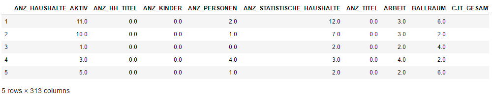  

## Ⅳ. Customer Segmentation Report
The main bulk of your analysis will come in this part of the project. Here, you should use unsupervised learning techniques to describe the relationship between the demographics of the company's existing customers and the general population of Germany. By the end of this part, you should be able to describe parts of the general population that are more likely to be part of the mail-order company's main customer base, and which parts of the general population are less so.
#### Step 1: PCA
>> - Use sklearn's [PCA](http://scikit-learn.org/stable/modules/generated/sklearn.decomposition.PCA.html) class to apply principal component analysis on the data, thus finding the vectors of maximal variance in the data. To start, you should not set any parameters (so all components are computed) or set a number of components that is at least half the number of features (so there's enough features to see the general trend in variability).
>> - Check out the ratio of variance explained by each principal component as well as the cumulative variance explained. Try plotting the cumulative or sequential values using matplotlib's [`plot()`](https://matplotlib.org/api/_as_gen/matplotlib.pyplot.plot.html) function. Based on what you find, select a value for the number of transformed features you'll retain for the clustering part of the project.
>> - Once you've made a choice for the number of components to keep, make sure you re-fit a PCA instance to perform the decided-on transformation.
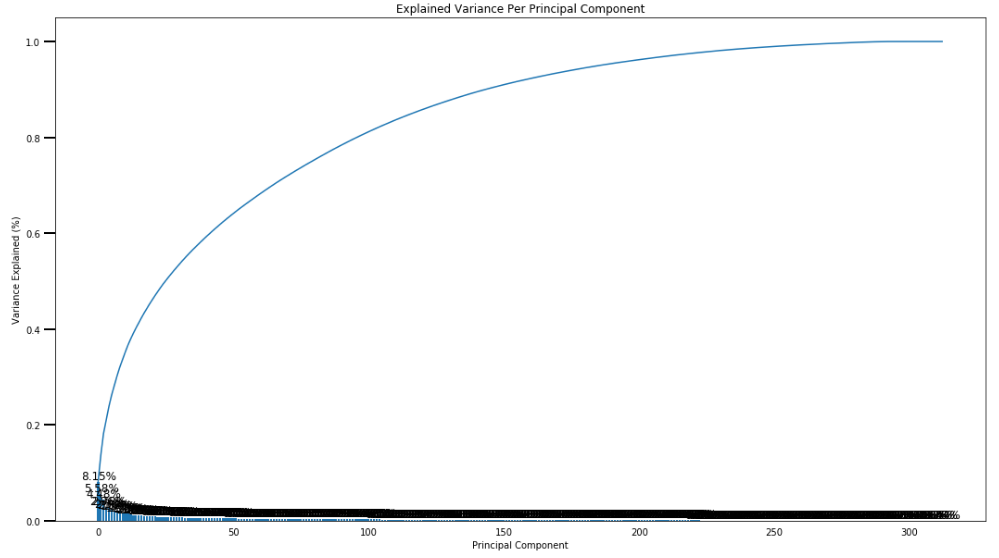  
>here, we keep 150 components, and re-fit a PCA to perform the decided-on transformation.  
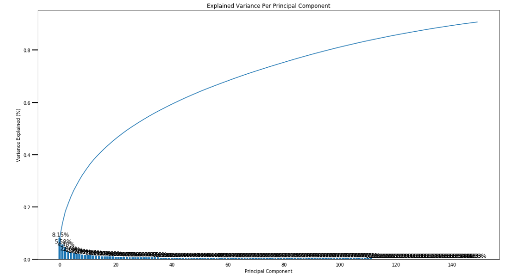  
>150 components can explain 90% of the variance.
>
#### Step 2：Interpret Principal Components 
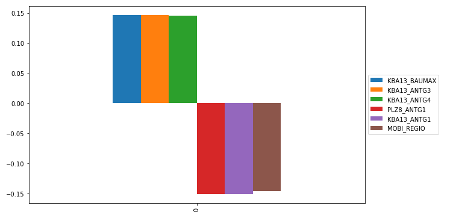  
For example, through the frist components, we can get main positive effect features ,and negative effect features.

#### Step 3：Clustering and Evaluation
In this substep, we will apply k-means clustering to the dataset and use the average within-cluster distances from each   
point to their assigned cluster's centroid to decide on a number of clusters to keep.  
  
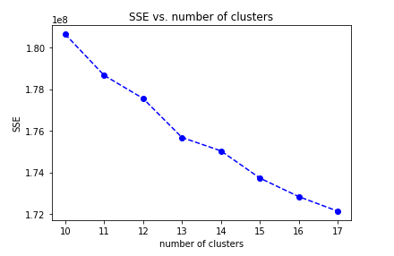  
In the range number 10-18, I choose 13 clusters for k-means model,  
because the average distance decrease is obiviously smaller than before.

#### Step 4：Apply All Steps to the Customer Data
here, we apply all steps to the customer data from "Udacity_CUSTOMERS_052018.csv"  
we get the cleaned customer data, and apply principal component analysis.
#### Step 4.1：Compare Customer Data to Demographics Data
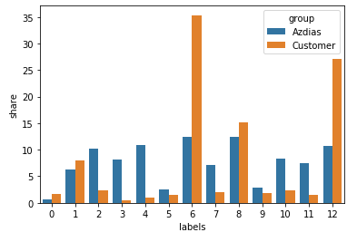  
from above compare, we can see, customers are higher than general population in the cluster 6 and cluster 12.
We parse these two clusters's feature and get main positive feature, negative feature.
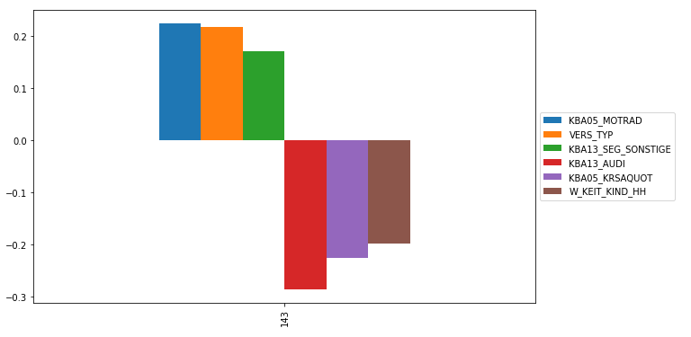  
- Customer's high positive correlation  
KBA05_MOTRAD  : share of motorcycles per household  
VERS_TYP  : insurance typology  
KBA13_SEG_SONSTIGE : share of other cars within the PLZ8 
  
- Customer's high negative correlation  
KBA13_AUDI : share of AUDI within the PLZ8    
KBA05_KRSAQUOT  : share of cars per household (reffered to county average)  
W_KEIT_KIND_HH : likelihood of a child present in this household  

## Ⅴ. Supervised Learning Model
Now that we've found which parts of the population are more likely to be customers of the mail-order company, it's time  
to build a prediction model. Each of the rows in the "MAILOUT" data files represents an individual that was targeted for  
a mailout campaign. Ideally, we should be able to use the demographic information from each individual to decide whether  
or not it will be worth it to include that person in the campaign.

The "MAILOUT" data has been split into two approximately equal parts, each with almost 43 000 data rows. In this part,   
we can verify our model with the "TRAIN" partition, which includes a column, "RESPONSE", that states whether or not a   
person became a customer of the company following the campaign. In the next part, we'll need to create predictions on   
the "TEST" partition, where the "RESPONSE" column has been withheld.  
#### Step1: clean and parse data
- all the apply functions are same with previous steps
- split data for training
#### Step2: create models
- We build some base models, and get roc_auc_score value 
- We use hyperopt、pipline to optimize the model params, use Gradient Boosting Classifier as a meta-learner  
reference from [github](https://github.com/hyperopt/hyperopt)
- use mlens library developed by Sebastian Flannerhag  from [site](www.ml-ensemble.org)  

here are the ROC AUC scores of all the models:  
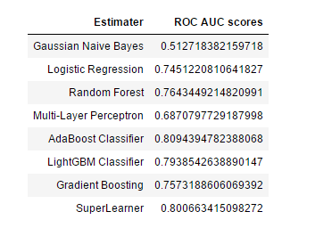

SuperLearner's ROC AUC scores is stable up to 0.8   
Then we train the dataset and save the trained model for kaggle competition.

## Ⅵ. Conclusion

- In explor and analysis steps, we should know all the features from "DIAS Attributes - Values 2017.xlsx" ,  
"DIAS Information Levels - Attributes 2017.xlsx", in order to get better understanding about datasets.

- In parse and processing steps, we need set unknown data into Nan value,  we should drop large Nan percentage  
columns and rows in datasets,
then we convert categorical features to dummy varibales and decomposing mixed features.

- In customer segmentation，we apply PCA module to parse the features, then select half of the features,  
Using k-means, we segment the customer into 13 clusters. We can compare the customer and the general  
population by cluster distribution. Through comparison, we find the key features.

- In supervised learning, we use several base models and use pipline, mlens to build a stable estimater.

- In fact, there are still many areas can be optimized in data cleaning, data scaling, models params, etc.
We can do more activate later.
  
- At last, thanks for Udacity and Arvato.This is a really interesting machine learning project.Thanks!
